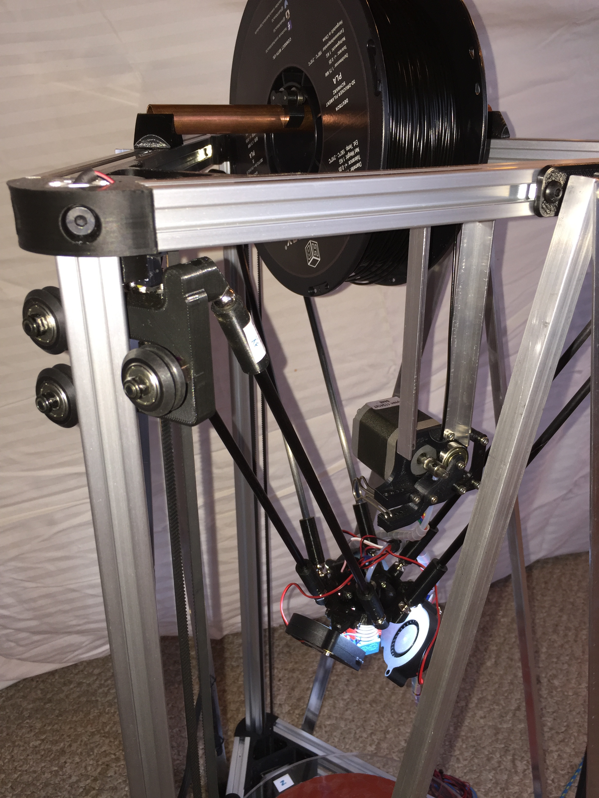
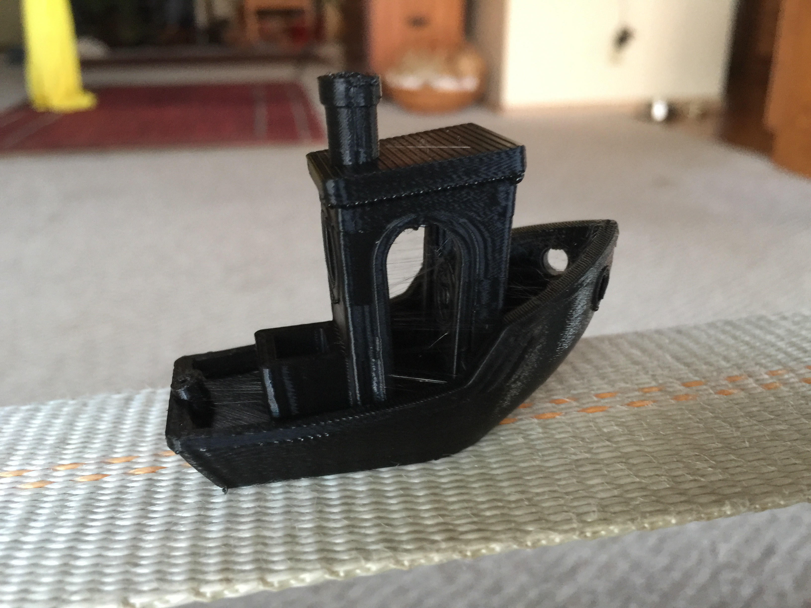
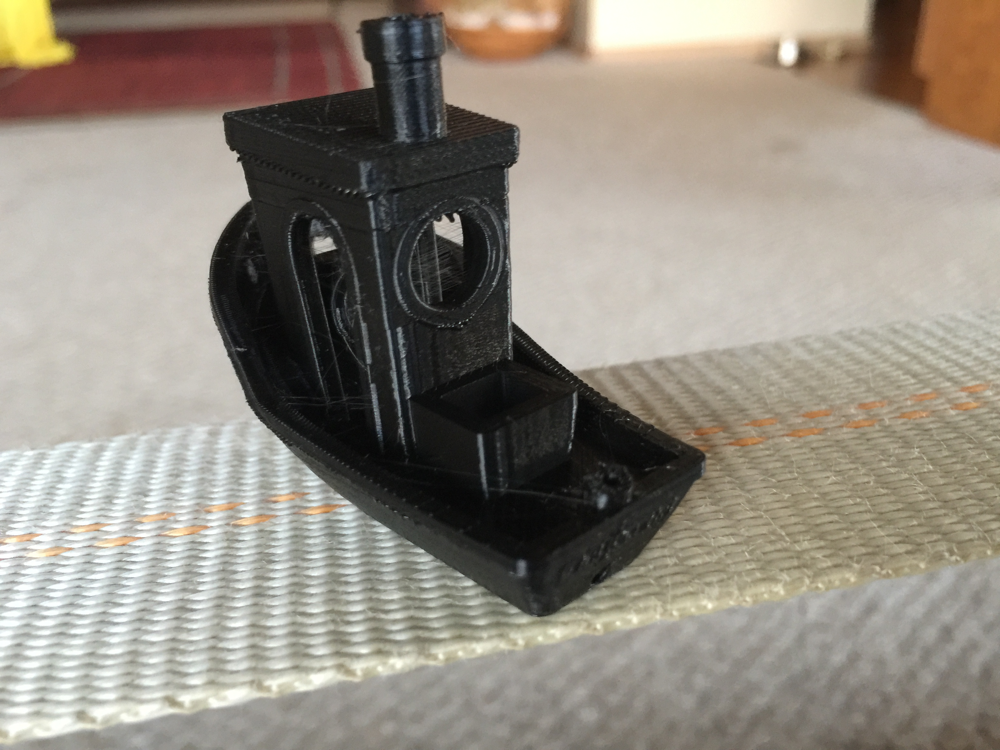

# kumu-3d

## The Kumu-3D Printer

### *Kumu* means *teacher* in the Hawaiian language.

I wish to thank Johann C. Rocholl for his groundbreaking work on the Rostock and Kossel 3D Printers. This design was derived from his work and that of many other innovators.

The Kumu-3D is a Delta printer improving on the [Kossel Plus](http://www.kosselplus.com "Kossel Plus"), which I designed to extend and improve on Johann's original [Kossel](http://reprap.org/wiki/Kossel "Kossel").

The Kumu-3D's features are:

* 300mm diameter borosilicate build plate, yielding a build area over 250mm in diameter.
* 250mm diameter 24V 250W silicone heater.
* 24v power supply, to give the motors twice as much power for faster acceleration and more precise positioning.
* E3D hotend.
* 32-bit Smoothieware controller from AZSMZ, with LCD display.
* Carbon fiber, magnetic, zero-backlash arms.
* 0.9&deg; motors, 1/32 stepping, 16-tooth pulleys yield 400 steps/mm with a worst case real world resolution of 20&micro;m and an average resolution of about one-third of that.
* Dampers for near silent operation.
* 2020 extrusions with diagonal bracing for increased stiffness.
* flying extruder for better retraction performance.
* optional 9mm GT2 belts for increased precision.
* Integrated spool holder with bearings on top.
* Build cost around $600 in quantity one, including US shipping.
* With the standard 750mm vertical extrusions and 304mm arms, it yields a maximum Z of 290mm and maximum diameter of 260mm.  With 1000mm vertical extrusions and 360mm arms, it should yield a build height of over 500mm and diameter up to 300mm.

Here is the GoogleDocs spreadsheet containing the [Bill of Materials](https://docs.google.com/spreadsheets/d/1ovnhxit7gjctnHXA3ArEihpogoxfmhG4zKcSKq6PfBs/edit?usp=sharing). 
Here is a list of the fasteners required and where they are used: [Fasteners](https://docs.google.com/spreadsheets/d/1ovnhxit7gjctnHXA3ArEihpogoxfmhG4zKcSKq6PfBs/edit#gid=828928504)

Note: this is no longer a *Work-in-Progress* -- the first six Kumu-3D's have been built and are printing, and four more are on the way!  I'm in the process of writing up how to build them, which is at:  [Documentation] (https://docs.google.com/document/d/1tWf-NENtzvH9kXuD4_r2AeAENZi3MvYkmVscPsnDQXc/edit?usp=sharing)

This isn't an average printer, it is an **extraordinary** one.

I am creating this project for students at Maui College and hope it is useful to enthusiasts everywhere!  :-)

Here is a link to the extruder (designed by Shane Beeder):  [ArmDrive Bowden Extruder](http://www.thingiverse.com/thing:245677)  
I use the version for the Mk8 drive gear and the alternative arm which uses a 4mm nut to secure the PTFE tubing.
Note: print the two arm parts in ABS.

Here is a link to the AZSMZ's LCD display holder (designed by Rick Yang):  [
LCD mount for AZSMZ 12864 with TF slot](http://www.thingiverse.com/thing:1610241)

Here are some photos of Kumu-3D#1:

Here are some photos of a 3DBenchy torture test printed in PLA at 60mm/sec:

There is a little bit of very fine stringing, so I'll need to increase the retraction or lower the temperature.
Note how nicely it handled the overhangs.

<!---
Some useful links for Markdown language:
 * [Adam's Markdown Cheatsheet](https://github.com/adam-p/markdown-here/wiki/Markdown-Cheatsheet)
 * [Laura's Markdown Cheatsheet](https://github.com/tchapi/markdown-cheatsheet/blob/master/README.md)
 * [Markdown Syntax Guide](https://confluence.atlassian.com/bitbucketserver/markdown-syntax-guide-776639995.html)
--->
